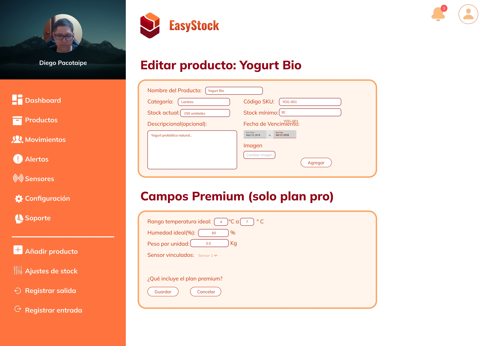
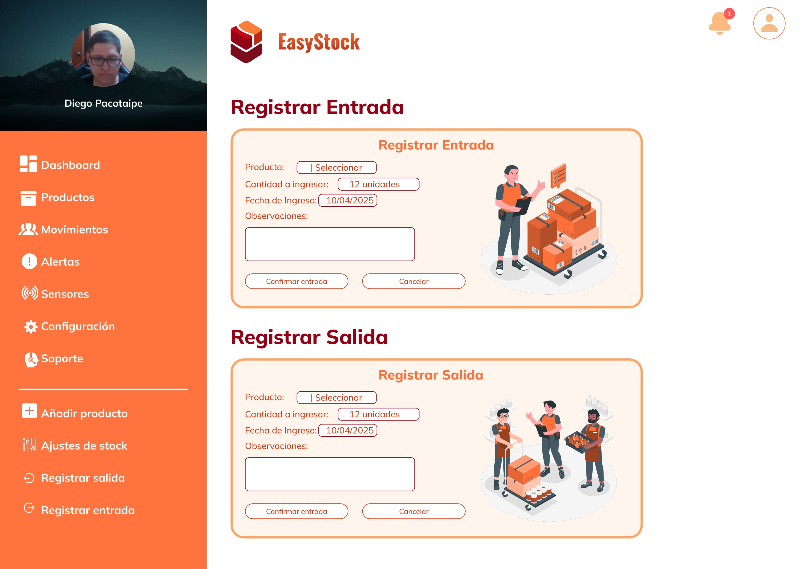

# <center>COURSE PROJECT<center>

<p align="center">
    <strong>Universidad Peruana de Ciencias Aplicadas</strong><br>
    </img><br>
    <strong>Ingeniería de Software</strong><br>
    <strong>Desarrollo de Aplicaciones Open Source - 4350</strong><br>
    <strong>Profesor: Angel Augusto Velasquez Nuñez </strong><br>
    <br>INFORME TB1
</p>

<center>

#### Startup: **RurasqaySoft**

#### Product: **EasyStock**

</center>

### <center>Team Members</center>

<center>

| Member                           | Code       |
| -------------------------------- | ---------- |
| Alvarado De La Cruz, Juan Carlos | u202216150 |
| Barrientos Quispe, Marcelo       | u20221e646 |
| Rioja Nuñez, Franco Diego        | u202221597 |
| Nakasone Gomes, Marco Antonio    | u202210790 |
| Rivera Ticllacuri, Omar Harold   | u202214214 |

<br> ABRIL 2025

</center>

<center>

# Registro de Versiones del Informe

| Version | Fecha      | Autor   | Descripción de Modificación |
| ------- | ---------- | ------- | --------------------------- |
| 0.0     | 02/04/2025 | Grupo 3 | Creación del documento      |
|         | 04/04/2025 |         |                             |
|         | 04/04/2025 |         |                             |

</center>

# Project Report Collaboration Insights

Analiza cómo la colaboración y la gestión de tareas influyeron en los resultados del proyecto, destacando fortalezas y áreas de mejora para optimizar futuras estrategias.

# Contenido

[Registro de Versiones del Informe](#registro-de-versiones-del-informe)  
[Project Report Collaboration Insights](#project-report-collaboration-insights)  
[Student Outcome](#student-outcome)

[Capítulo I: Introducción](#capítulo-i-introducción)

[1.1 Startup Profile](#11-startup-profile)  
[1.1.1. Descripción de la Startup](#111-descripción-de-la-startup)  
[1.1.2. Perfiles de integrantes del equipo](#112-perfiles-de-integrantes-del-equipo)

[1.2. Solution Profile](#12-solution-profile)  
[1.2.1 Antecedentes y problemática](#121-antecedentes-y-problemática)  
[1.2.2 Lean UX Process.](#122-lean-ux-process)  
[1.2.2.1. Lean UX Problem Statements.](#1221-lean-ux-problem-statements)  
[1.2.2.2. Lean UX Assumptions.](#1222-lean-ux-assumptions)  
[1.2.2.3. Lean UX Hypothesis Statements.](#1223-lean-ux-hypothesis-statements)  
[1.2.2.4. Lean UX Canvas.](#1224-lean-ux-canvas)

[1.3. Segmentos objetivo.](#13-segmentos-objetivo)

[Capítulo II: Requirements Elicitation & Analysi](#capítulo-ii-requirements-elicitation--analysis)

[2.1. Competidores](#21-competidores)  
[2.1.1. Análisis competitivo](#211-análisis-competitivo)  
[2.1.2. Estrategias y tácticas frente a competidores](#211-análisis-competitivo)

[2.2. Entrevistas](#22-entrevistas)  
[2.2.1. Diseño de entrevistas](#221-diseño-de-entrevistas)  
[2.2.2. Registro de entrevistas](#222-registro-de-entrevistas)  
[2.2.3. Análisis de entrevistas](#223-análisis-de-entrevistas)

[2.3. Needfinding](#23-needfinding)  
[2.3.1. User Personas](#231-user-personas)  
[2.3.2. User Task Matrix](#232-user-task-matrix)  
[2.3.3. User Journey Mapping](#233-user-journey-mapping)  
[2.3.4. Empathy Mapping](#234-empathy-mapping)  
[2.3.5. As-is Scenario Mapping](#235-as-is-scenario-mapping)

[2.4. Ubiquitous Language](#24-ubiquitous-language)

[Capítulo III: Requirements Specificatio](#capítulo-iii-requirements-specification)

[3.1. To-Be Scenario Mapping](#31-to-be-scenario-mapping)  
[3.2. User Stories](#32-user-stories)  
[3.3. Impact Mapping](#33-impact-mapping)  
[3.4. Product Backlog](#34-product-backlog)

[Capítulo IV: Product Design](#capítulo-iv-product-design)

[4.1. Style Guidelines.](#41-style-guidelines)  
[4.1.1. General Style Guidelines.](#411-general-style-guidelines)  
[4.1.2. Web Style Guidelines.](#412-web-style-guidelines)

[4.2. Information Architecture.](#42-information-architecture)  
[4.2.1. Organization Systems.](#421-organization-systems)  
[4.2.2. Labeling Systems.](#422-labeling-systems)  
[4.2.3. SEO Tags and Meta Tags.](#423-seo-tags-and-meta-tags)  
[4.2.4. Searching Systems.](#424-searching-systems)  
[4.2.5. Navigation Systems.](#425-navigation-systems)

[4.3. Landing Page UI Design.](#43-landing-page-ui-design)  
[4.3.1. Landing Page Wireframe.](#431-landing-page-wireframe)  
[4.3.2. Landing Page Mock-up.](#432-landing-page-mock-up)

[4.4. Web Applications UX/UI Design.](#44-web-applications-ux-ui-design)  
[4.4.1. Web Applications Wireframes.](#441-web-applications-wireframes)  
[4.4.2. Web Applications Wireflow Diagrams.](#442-web-applications-wireflow-diagrams)  
[4.4.3. Web Applications Mock-ups.](#443-web-applications-mock-ups)  
[4.4.4. Web Applications User Flow Diagrams.](#444-web-applications-user-flow-diagrams)

[4.5. Web Applications Prototyping.](#45-web-applications-prototyping)

[4.6. Domain-Driven Software Architecture.](#46-domain-driven-software-architecture)  
[4.6.1. Software Architecture Context Diagram.](#461-software-architecture-context-diagram)  
[4.6.2. Software Architecture Container Diagrams.](#462-software-architecture-container-diagrams)  
[4.6.3. Software Architecture Components Diagrams.](#463-software-architecture-components-diagrams)

[4.7. Software Object-Oriented Design.](#47-software-object-oriented-design)  
[4.7.1. Class Diagrams.](#471-class-diagrams)  
[4.7.2. Class Dictionary.](#472-class-dictionary)

[4.8. Database Design.](#48-database-design)  
[4.8.1. Database Diagram.](#481-database-diagram)

[Capítulo V: Product Implementation, Validation & Deployment](#capítulo-v-product-implementation-validation-deployment)

[5.1. Software Configuration Management.](#51-software-configuration-management)  
[5.1.1. Software Development Environment Configuration.](#511-software-development-environment-configuration)  
[5.1.2. Source Code Management.](#512-source-code-management)  
[5.1.3. Source Code Style Guide & Conventions.](#513-source-code-style-guide--conventions)
[5.1.4. Software Deployment Configuration.](#514-software-deployment-configuration)

[5.2. Landing Page, Services & Applications Implementation.](#52-landing-page-services--applications-implementation)
[5.2.1. Sprint n.](#521-sprint-n)  
[5.2.1.1. Sprint Planning n.](#5211-sprint-planning-n)  
[5.2.1.2. Aspect Leaders and Collaborators.](#5212-aspect-leaders-and-collaborators)  
[5.2.1.3. Sprint Backlog n.](#5213-sprint-backlog-n)  
[5.2.1.4. Development Evidence for Sprint Review.](#5214-development-evidence-for-sprint-review)  
[5.2.1.5. Execution Evidence for Sprint Review.](#5215-execution-evidence-for-sprint-review)  
[5.2.1.6. Services Documentation Evidence for Sprint Review.](#5216-services-documentation-evidence-for-sprint-review)  
[5.2.1.7. Software Deployment Evidence for Sprint Review.](#5217-software-deployment-evidence-for-sprint-review)  
[5.2.1.8. Team Collaboration Insights during Sprint.](#5218-team-collaboration-insights-during-sprint)

[Conclusiones](#conclusiones)  
[Conclusiones y recomendaciones.](#conclusiones-y-recomendaciones)  
[Video About-the-Team.](#video-about-the-team)

[Bibliografía](#bibliografía)

[Anexos](#anexos)

# **Student Outcome**

**ABET - EAC - Student Outcome 3:** Capacidad de comunicarse efectivamente con un rango de audiencias.

| Criterio Especifico                                                    | Acciones Realizadas                                                                                                                                                                                                                                                                                                                                             | Conclusiones |
| ---------------------------------------------------------------------- | --------------------------------------------------------------------------------------------------------------------------------------------------------------------------------------------------------------------------------------------------------------------------------------------------------------------------------------------------------------- | ------------ |
| Comunica oralmente con efectividad a diferentes rangos de audiencia.   | <br> **Marco Nakasone:** <br> **TB1:** <br> Durante la primera entrega me encargue de hacer una parte del capítulo 3, agregando las epics, las user stories, los impact mapping y el product backlog, pude obtener más conocimiento de como se puede hacer bien un impact mapping, y a la vez como poder integrar las historias de usuario en un proyecto. <br> |
| Comunica por escrito con efectividad a diferentes rangos de audiencia. | <br> **Marco Nakasone:** <br> **TB1:** <br> Durante la primera entrega pude crear las historias de usuario, basandome en entrevistas e informacion recopilada con respecto a nuestro proyecto, aquí pude aprender mejor sobre lo que necesitan nuestros usuarios objetivos.                                                                                     |

# Capítulo I: Introduccion

## 1.1. Startup Profile

### 1.1.1. Descripción de la Startup

**_Mision:_**

**_Visión:_**

### 1.1.2. Perfiles de integrantes del equipo

|     | Apellido y Nombre | Carrera                | Acerca de     | Habilidades   |
| --- | ----------------- | ---------------------- | ------------- | ------------- |
|     |                   | Ingeniería de Software | Escribir aqui | Escribir aqui |
|     |                   | Ingeniería de Software | Escribir aqui | Escribir aqui |
|     |                   | Ingeniería de Software | Escribir aqui | Escribir aqui |
|     |                   | Ingeniería de Software | Escribir aqui | Escribir aqui |
|     |                   | Ingeniería de Software | Escribir aqui | Escribir aqui |

## 1.2. Solution Profile

Product Name:

### 1.2.1. Antecedentes y problemática

**Antecedentes:**

**Problematicas:**

**What**

- **Why: ¿Por qué es importante que se gestione el inventario en los restaurantes?**

  **Who: ¿Quienes se ven afectados?**

- **When: ¿Cuándo sucede la problemática?**

- **Where: ¿Dondé implementaríamos nuestra solución?**

- **How: ¿Cómo ayudará nuestra solución?**

  **How much: ¿Cúanto costará?**

### 1.2.2. Lean UX Process

#### 1.2.2.1. Lean UX Problem Statements

#### 1.2.2.2. Lean UX Assumptions

#### 1.2.2.3. Lean UX Hypothesis Statements

#### 1.2.2.4. Lean UX Canvas.

## 1.3. Segmentos Objetivos

# Capitulo II: Requeriments Elicitation & Analysis

## 2.1. Competidores

### 2.1.1. Análisis competitivo

### 2.1.2. Estrategias y tácticas frente a competidores

## 2.2. Entrevistas

### 2.2.1. Diseño de entrevistas

### 2.2.2. Registro de entrevistas

### 2.2.3. Análisis de entrevistas

## 2.3. Needfinding

### 2.3.1. User Personas

### 2.3.2. User Task Matrix

### 2.3.3. User Journey Mapping

### 2.3.4. Empathy Mapping

### 2.3.5. As-Is Scenario Mapping

## 2.4. Ubiquitous Language

# Capitulo III: Requeriments Specification

## 3.1. To-Be Scenario Mapping

## 3.2. User Stories

## 3.3. Impact Mapping

## 3.4. Product Backlog

# Capítulo IV: Product Design

## 4.1. Style Guidelines

En esta sección, se presentarán de forma estructurada los estilos y herramientas que se emplearán para llevar a cabo el diseño de nuestra solución.

### 4.1.1. General Style Guidelines

**Brand Overiew**
Administrar un inventario puede convertirse en una tarea compleja para muchos emprendedores, especialmente cuando se trata de productos sensibles o de alto volumen. La falta de herramientas accesibles para monitorear el estado de los insumos y automatizar procesos genera errores, pérdidas económicas y una gran carga de trabajo. EasyStock nace como una solución pensada para optimizar la gestión de almacenes en pequeños y medianos emprendimientos. Utilizando sensores inteligentes que miden temperatura, peso y otros parámetros clave, nuestra plataforma permite monitorear inventarios en tiempo real y recibir alertas automáticas, garantizando la conservación de productos y mejorando la eficiencia operativa.
**Brand Name**
El nombre EasyStock refleja claramente nuestra propuesta de valor: facilitar (Easy) el control de inventarios o stocks (Stock). Es un nombre directo, simple y fácil de recordar, ideal para conectar con nuestro público objetivo: emprendedores que buscan soluciones accesibles y efectivas. Además, el uso del inglés le otorga un alcance global, permitiendo que la marca se adapte a futuros mercados internacionales.

A continuación, se presenta el Logo:


**Typography**

La tipografía en EasyStock ha sido cuidadosamente seleccionada para transmitir profesionalismo, simplicidad y modernidad. Utilizamos una combinación tipográfica que equilibra carácter y legibilidad: "Oswald" para los títulos, por su presencia fuerte y estructura condensada que aporta impacto visual, y entre "Arimo" y "Mulish" para los textos, debido a su claridad, suavidad y excelente rendimiento en interfaces digitales. La jerarquía tipográfica se organiza en encabezados, cuerpo de texto, botones y enlaces, asegurando una experiencia visual coherente y armoniosa.

**Colors**
La paleta de colores de EasyStock está diseñada para generar confianza, orden y eficiencia. Cada color fue seleccionado considerando su impacto emocional y su funcionalidad en la interfaz desarrollada.

- **Color Primario (#C60619):** Este rojo vibrante y profundo transmite urgencia, acción inmediata y control. Es el color principal de la marca, usado en botones clave y encabezados importantes, reforzando la necesidad de monitoreo en tiempo real y decisiones ágiles.

- **Color Secundario (#FF7C39):** Este rojo anaranjado capta rápidamente la atención y es ideal para advertencias o alertas sobre el estado de los insumos. Su intensidad visual lo hace útil en elementos que requieren respuesta inmediata.

- **Color Secundario (#FF6200):** Un naranja fuerte que aporta dinamismo y energía. Se emplea para destacar acciones secundarias, recomendaciones o procesos interactivos que guían al usuario dentro del sistema.

- **Color Secundario (#FFA360):** Este tono más claro de naranja proporciona un contraste cálido y armonioso. Se utiliza en secciones informativas o como fondo para destacar sin abrumar.

- **Color Secundario (#FFC397):** Un tono durazno claro que transmite cercanía y accesibilidad. Ideal para tarjetas informativas, ilustraciones o componentes visuales secundarios.

- **Color Secundario (#FFE1D5):** Suaviza la interfaz y permite una lectura cómoda. Funciona como fondo complementario o en áreas que necesitan un enfoque más relajado y limpio.

- **Color de Contraste (#60030C):** Este rojo oscuro profundo refuerza la identidad visual en contrastes marcados o elementos de marca como el logo. Aporta solidez y seriedad al diseño.

- **Colores de apoyo adicionales:** También se utilizan tonos como `#950015`, `#DE2E03`, `#C00000`, `#FF703A`, `#FF733F`, y `#BD2A11` en detalles específicos para enriquecer visualmente la interfaz sin perder coherencia.

- **Colores para texto y contraste:** Se emplea el **negro (#000000)** y el **blanco (#FFFFFF)** para garantizar legibilidad en títulos, párrafos, botones y fondos según el contexto. Estos colores aseguran un contraste claro y accesible en la interfaz.
  
  _Colores realizados en el figma: https://www.figma.com/design/TxnqzpKuoMpU5seAHM7C4j/EasyStock?node-id=74-247&p=f&t=je4Qxg6oNKqqpHSI-0_

**Spacing**
El spacing a considerar para mantener el contenido entendible será:

- Button padding: 8 px (vertical), 16–38 px (horizontal)
- Input fields: auto (sin altura fija), 16 px (espacio entre campos usando margin-top)
- Margin entre secciones: 60 px
- Height entre textos: 30 px en h2, 10–15 px en p

**Dimensions**
En EasyStock se optó por una comunicación clara, accesible y profesional, pero sin dejar de ser cercana. La marca busca transmitir confianza y eficiencia, usando un lenguaje directo que oriente al usuario sin resultar frío o impersonal. Queremos que nuestros clientes sientan que tienen el control de su inventario con una herramienta moderna, útil y fácil de entender, evitando tecnicismos innecesarios y manteniendo siempre un tono amable y resolutivo.

### 4.1.2. Web Style Guidelines

Se estableció una guía detallada para la presentación de los productos, la cual define los componentes que deben utilizarse en la página web. Esta guía considera la paleta de colores previamente mencionada, con el objetivo de captar la atención de los usuarios y fomentar una navegación más atractiva e intuitiva por los productos. Enlace al esquema:


EasyStock contará con una interfaz web responsive, capaz de adaptarse sin problemas a cualquier dispositivo, desde smartphones hasta monitores de escritorio. El diseño está enfocado en ofrecer una experiencia intuitiva, clara y rápida, permitiendo a los usuarios tomar decisiones inmediatas sobre su inventario sin complicaciones.

Se ha optado por implementar el patrón Z, que guía la mirada del usuario a través de una secuencia lógica: inicio en el logo (esquina superior izquierda), navegación hacia el menú (esquina superior derecha), desplazamiento visual hacia el contenido principal (centro), y final en la información corporativa y contactos (parte inferior derecha). Esta estructura mejora la retención del contenido y asegura que los elementos más importantes estén en zonas de alto impacto visual.

Los colores y espacios están pensados para reducir la fatiga visual, mientras que las animaciones suaves y las alertas visuales permiten que el usuario reaccione rápidamente ante cualquier cambio en su inventario.


## 4.2. Information Architecture

A lo largo de esta sección, se expondrán los criterios y fundamentos que respaldan la forma en que se estructura el contenido en las versiones web y móvil de EasyStock, incluyendo tanto la página principal como la aplicación. La propuesta busca garantizar una experiencia de navegación clara y sencilla, permitiendo que los usuarios localicen de manera rápida y eficiente la información y las herramientas disponibles.

### 4.2.1. Organization Systems

Para estructurar la arquitectura de la información en EasyStock, se ha implementado un sistema jerárquico tanto en la Landing Page como en la Aplicación Web. Esta estrategia permite una navegación clara e intuitiva, asegurando que los usuarios puedan acceder con facilidad a la información y funcionalidades que necesitan.

**Visual Organization**

En EasyStock se optó por una organización visual basada en la jerarquía para facilitar la lectura y comprensión del contenido. De esta manera, el usuario puede identificar de inmediato qué información tiene mayor relevancia dentro del sistema. Se asignaron distintos tamaños de texto dependiendo del peso informativo: para los títulos principales se utilizaron tamaños entre 48px y 40px, mientras que los subtítulos emplean tamaños entre 32px y 24px, y los textos secundarios como descripciones o instrucciones utilizan tamaños entre 16px y 14px. Además, se implementó una estructura secuencial especialmente en los flujos de registro de productos, actualización de stock y generación de reportes, para guiar al usuario paso a paso y evitar errores.

**Categorization Schemes**

Para la categorización, se escogieron tres esquemas:

**Alfabético**

Los productos dentro del inventario se presentan de forma alfabética en las secciones de consulta y edición, lo que permite a los encargados encontrar artículos específicos de forma rápida y eficiente, sin importar el volumen del inventario.

**Cronológico**

Los movimientos de inventario como entradas y salidas de productos se registran y muestran de manera cronológica, lo cual facilita el seguimiento de la trazabilidad del stock. Así, los usuarios pueden verificar fácilmente qué productos han sido ingresados o retirados más recientemente.

**Audiencia**

Dado que EasyStock está pensado tanto para gerentes como para operarios de almacén, la interfaz adapta el contenido mostrado según el tipo de usuario. Por ejemplo, los gerentes acceden a reportes analíticos y gráficos de rendimiento, mientras que los operarios visualizan opciones más operativas como el escaneo de productos y el control diario del inventario. Esta separación asegura que cada grupo de usuarios reciba información relevante a sus necesidades, evitando sobrecarga de datos y mejorando la eficiencia del uso de la aplicación.

### 4.2.2. Labeling Systems

Para etiquetar visualmente los botones y funcionalidades dentro de nuestra aplicación desarrollada con Angular, optamos por una solución que permita a los usuarios identificar fácilmente la función de cada elemento. Por esta razón, seleccionamos los íconos proporcionados por PrimeNG Icons (https://primefaces.org/primeng/icons), ya que se integran de forma nativa con Angular y ofrecen un diseño intuitivo y representativo de las acciones que acompañan.

Estos íconos se incorporarán en todos los módulos de la aplicación Angular a través de los componentes de PrimeNG, asegurando una experiencia de usuario fluida, accesible y visualmente coherente. La integración se realizará directamente en las plantillas HTML utilizando las clases de íconos que proporciona PrimeNG, lo que permite una implementación rápida y estandarizada en el proyecto.

En la landing page del sistema, se utilizarán exclusivamente íconos de redes sociales como Instagram, Facebook y X (Twitter) para facilitar canales de contacto directo con los usuarios.

### Etiquetas de Encabezados (Headings)

Las etiquetas de encabezado permiten identificar claramente las secciones principales tanto en la landing page como en la aplicación:

- **Inicio / Home**: Sección principal de bienvenida con un banner central, mensajes clave y botones de acción para iniciar sesión o registrarse.
- **Características / Features**: Expone de manera clara lo que ofrece EasyStock, como control de stock, sensores integrados, alertas automáticas y reportes.
- **Beneficios / Benefits**: Destaca cómo la plataforma mejora la gestión de inventario, optimiza procesos y reduce errores.
- **Planes / Plans**: Describe las opciones de suscripción y precios disponibles, ayudando al usuario a comparar y elegir.
- **Funcionamiento / How it Works**: Explica el flujo de uso del sistema paso a paso para cada tipo de usuario.
- **Testimonios / Testimonials**: Presenta experiencias reales de usuarios que ya han implementado EasyStock.

### Etiquetas Textuales (Text Labels)

Estas etiquetas están presentes en botones, formularios y paneles para indicar acciones o funcionalidades específicas dentro de la aplicación:

- **Buscar producto / Search Product**: Permite encontrar productos por nombre, categoría o código.
- **Añadir producto / Add Product**: Opción para registrar nuevos productos en el sistema.
- **Registrar entrada / Register Entry** y **Registrar salida / Register Exit**: Acciones para actualizar el inventario en tiempo real.
- **Ajustes de stock / Stock Adjustment**: Función para corregir manualmente cantidades.
- **Reportes y estadísticas / Reports and Stats**: Acceso a datos visuales y analíticos.
- **Gestión de usuarios / User Management**: Control de accesos y permisos por roles.
- **Mi plan y facturación / My Plan and Billing**: Visualización del plan activo, historial de pagos y actualizaciones.
- **Configuración / Settings**: Preferencias del sistema, idioma, notificaciones y más.
- **Soporte / Support**: Acceso a ayuda técnica y contacto con el equipo.

### Etiquetas Icónicas (Iconic Labels)

Estas etiquetas utilizan íconos reconocibles para mejorar la experiencia del usuario a través de una navegación visual más intuitiva:

- **Icono de Lupa**: Representa la acción de buscar.
- **Icono de Caja**: Indica la sección de productos e inventario.
- **Icono de Flecha Derecha / Izquierda**: Representa las entradas y salidas de stock.
- **Icono de Alerta**: Señala alertas de stock bajo o vencimiento.
- **Icono de Engranaje**: Acceso a configuraciones generales del sistema.
- **Icono de Usuario**: Gestión de perfiles, usuarios y permisos.
- **Icono de Factura**: Información sobre suscripción y facturación.

Estas etiquetas se encuentran en la barra de navegación principal, paneles laterales, formularios y dashboards, guiando al usuario de forma eficiente y clara por toda la plataforma.

---

### 4.2.3. SEO Tags and Meta Tags

Los **SEO Tags** y **Meta Tags** son fundamentales para que la **Landing Page** y la **Aplicación Web** de **EasyStock** sean correctamente indexadas por los motores de búsqueda, mejorando su posicionamiento y accesibilidad.

**Landing Page**

```html
<meta charset="UTF-8" />
<meta name="viewport" content="width=device-width, initial-scale=1.0" />
<!-- for mobile -->
<title>EasyStock - Gestión de inventario inteligente</title>
<meta
  name="description"
  content="Optimiza el control de tus productos con EasyStock, la solución inteligente para la gestión de inventario de tu negocio."
/>
<meta
  name="keywords"
  content="gestión de inventario, control de stock, sistema de inventario, administración de productos, EasyStock"
/>
<meta name="author" content="Rurasqay" />
```

**Aplicaiones Web**

```html
<meta charset="UTF-8" />
<meta name="viewport" content="width=device-width, initial-scale=1.0" />
<title>EasyStock - Plataforma de control de inventario</title>
<meta
  name="description"
  content="Registra productos, gestiona movimientos, revisa reportes y mantén tu inventario actualizado con EasyStock. La solución para PYMES."
/>
<meta
  name="keywords"
  content="gestión de stock, inventario en tiempo real, control de productos, reportes de inventario, EasyStock"
/>
<meta name="author" content="Rurasqay" />
```

**Explicación**

`<meta charset="UTF-8">`: Define la codificación de caracteres utilizada, permitiendo el uso correcto de acentos, símbolos y caracteres especiales.

`<meta name="viewport" content="width=device-width, initial-scale=1.0">`: Hace que el diseño de la página sea responsive, adaptándose a diferentes tamaños de pantalla y dispositivos móviles.

`<title>`: Es el título que aparece en la pestaña del navegador y es uno de los elementos más relevantes para el SEO.

`<meta name="description" content="...">`: Proporciona una descripción corta y clara de la página que aparecerá en los resultados de búsqueda, atrayendo a los usuarios a hacer clic.

`<meta name="keywords" content="...">`: Incluye palabras claves relevantes para que los motores de búsqueda relacionen mejor el contenido de EasyStock con las búsquedas de los usuarios.

`<meta name="author" content="...">`: Identifica al equipo responsable del desarrollo de la aplicación y la página web.

### 4.2.4. Searching Systems

Los sistemas de búsqueda en **EasyStock** están diseñados para facilitar al usuario el acceso inmediato a la información que necesita, sin generar confusión o pérdida de tiempo. Estos métodos permiten filtrar, localizar y consultar datos de forma eficiente, incluso dentro de un inventario complejo o distribuido en múltiples ubicaciones.

#### Búsqueda por caracteres

La barra de búsqueda principal permite al usuario localizar productos, categorías o proveedores ingresando palabras clave como:

- Nombre del producto
- Código de identificación
- Marca o referencia

A medida que el usuario escribe, se mostrarán **sugerencias automáticas** con coincidencias relevantes para acelerar el proceso.

#### Búsqueda por ubicación

En contextos con múltiples almacenes, los usuarios podrán utilizar **filtros de ubicación** para visualizar únicamente los elementos almacenados en una sede específica. Esta opción es ideal para empresas con sedes descentralizadas o franquicias.

#### Búsqueda por mapa

Para una experiencia aún más visual e intuitiva, **EasyStock** integra una vista tipo mapa que permite seleccionar almacenes desde un panel geolocalizado. Al hacer clic en uno, se mostrará un resumen de su inventario y movimientos asociados.

#### Filtros avanzados

Una vez realizada la búsqueda, los resultados pueden refinarse usando filtros como:

- Fecha de ingreso
- Cantidad en stock
- Categoría del producto
- Proveedor
- Estado del stock (por ejemplo: bajo, crítico, normal)

Esto garantiza que incluso en grandes volúmenes de datos, el usuario siempre podrá encontrar con precisión lo que busca.

#### Asociación semántica en etiquetas

Para reforzar la comprensión del sistema, las etiquetas utilizadas en botones y menús (como "Contacto", "Agregar producto", "Ver historial") están diseñadas para ser **intuitivas y semánticamente claras**. Esto ayuda a los usuarios a relacionar rápidamente el contenido con su funcionalidad, evitando sobrecargar las interfaces con textos extensos.

### 4.2.5. Navigation Systems

El sistema de navegación de **EasyStock** ha sido cuidadosamente diseñado para guiar a los usuarios a través de la **Landing Page** y la **Aplicación Web** de forma intuitiva, clara y eficiente. El objetivo es permitir que tanto propietarios como gestores de inventario cumplan sus metas dentro de la plataforma sin fricciones, logrando una experiencia satisfactoria desde el primer uso.

### Estructura de navegación

La aplicación cuenta con una navegación jerárquica basada en un menú principal y accesos directos que permiten al usuario:

- **Iniciar sesión o registrarse** desde la landing page.
- Acceder al **Dashboard**, con una vista general del inventario.
- Navegar a secciones clave como:
  - **Productos**
  - **Movimientos**
  - **Alertas**
  - **Sensores**
  - **Configuración**
  - **Soporte**

Además, cada sección incluye botones visibles y accesos rápidos para realizar acciones como:

- Añadir nuevos productos
- Ajustar cantidades de stock
- Registrar entradas o salidas de mercancía

### Navegación especializada para propietarios

Los usuarios con rol de propietario pueden acceder a módulos adicionales como:

- **Reportes y estadísticas** con visualizaciones gráficas del rendimiento del inventario
- **Gestión de ventas** para analizar la relación entre inventario y actividad comercial
- **Gestión de usuarios** para administrar accesos y roles
- **Mi plan y facturación** para controlar su suscripción

### Adaptabilidad y experiencia móvil

Todo el sistema de navegación ha sido desarrollado con un enfoque **responsive**, permitiendo que la experiencia sea coherente en **computadoras, tablets y móviles**. Los elementos visuales como **colores**, **íconos intuitivos** y **etiquetas claras** refuerzan la orientación dentro de la aplicación incluso para usuarios sin experiencia previa en software de gestión.

## 4.3. Landing Page UI Design

Presentamos los resultados del diseño de la Aplicación Web en Figma.

### 4.3.1. Landing Page Wireframe

En esta sección se mostrarán los wireframes de la landing page, los cuales son representaciones de baja fidelidad que permiten visualizar la estructura y distribución de los elementos en la página. Estos esquemas no contemplan aún el uso de colores ni imágenes, ya que su propósito es definir la organización básica del contenido.
Link: https://www.figma.com/design/TxnqzpKuoMpU5seAHM7C4j/EasyStock?node-id=0-1&t=VS8JJf7IDHNU1S4k-1
Para Desktop Browser:

Para Mobile Browser:


### 4.3.2. Landing Page Mock-up

En esta sección se mostrarán los Mock-ups de la landing page, los cuales son representaciones de alta fidelidad que permiten visualizar la estructura y distribución de los elementos en la página. Estos esquemas no contemplan aún el uso de colores ni imágenes, ya que su propósito es definir la organización básica del contenido.
Link: https://www.figma.com/design/TxnqzpKuoMpU5seAHM7C4j/EasyStock?node-id=0-1&t=VS8JJf7IDHNU1S4k-1
Para Desktop Browser:

Para Mobile Browser:


## 4.4. Web Applications UX/UI Design

En esta sección se describe el proceso de diseño de la aplicación web, abarcando desde la elaboración de los wireframes hasta la creación de los mock-ups. Durante este desarrollo se consideraron las guías de estilo y los principios de arquitectura de la información previamente definidos, con el objetivo de asegurar una coherencia visual adecuada con la landing page del proyecto.

### 4.4.1. Web Applications Wireframes

Iniciar Sesión / Registro


Gestión de Membresías


Determinar el tipo de usuario


Ingreso de Información para el Tipo de Usuario

Grupo de Usuarios:


Detalles de cada producto para los encargados de stock


Registrar una entrada o salida de inventario y añadir notas


Pantalla de historial de movimientos por grupo o área


Pantalla de alertas activas de los sensores


### 4.4.2. Web Applications Wireflow Diagrams

User Goal: El usuario desea registrarse en la plataforma para empezar a gestionar su inventario.
.png>)
.png>)

User Goal: El usuario necesita acceder a su cuenta en EasyStock.
.png>)
User Goal: El usuario ha olvidado su contraseña y desea restablecerla.
.png>)
User Goal: El usuario desea añadir un nuevo producto a su inventario.
.png>)
User Goal: El usuario desea ver el historial de entradas y salidas de un producto específico.

.png>)
User Goal: El usuario desea añadir un nuevo sensor a productos y desea ver el historial de datos ambientales
.png>)

### 4.4.3. Web Applications Mock-ups

En esta parte se mostrarán los wireframes de la aplicación web, los cuales representan esquemas de baja fidelidad que funcionan como un plano inicial. Su propósito es definir la estructura general de la interfaz antes de avanzar hacia la aplicación de guías de estilo e incorporación de elementos visuales.

Iniciar Sesión / Registro


Gestión de Membresías


Determinar el tipo de usuario


Ingreso de Información para el Tipo de Usuario

Grupo de Usuarios:


Detalles de cada producto para los encargados de stock


Registrar una entrada o salida de inventario y añadir notas


Pantalla de historial de movimientos por grupo o área


Pantalla de alertas activas de los sensores


### 4.4.4. Web Applications User Flow Diagrams

User Goal: El usuario desea registrarse en la plataforma para empezar a gestionar su inventario.
.png>)
.png>)

User Goal: El usuario necesita acceder a su cuenta en EasyStock.
.png>)
User Goal: El usuario ha olvidado su contraseña y desea restablecerla.
.png>)
User Goal: El usuario desea añadir un nuevo producto a su inventario.
.png>)
User Goal: El usuario desea ver el historial de entradas y salidas de un producto específico.

.png>)
User Goal: El usuario desea añadir un nuevo sensor a productos y desea ver el historial de datos ambientales
.png>)

## 4.5. Web Applications Prototyping

En esta sección se presentará el prototipo interactivo de nuestra aplicación web, el cual servirá para ilustrar su funcionamiento previsto. Esto nos permitirá contar con una referencia visual y funcional de lo que aspiramos a desarrollar, brindando una idea concreta del comportamiento que tendrá la aplicación en su versión final.

Enlace al video del prototipo: https://upcedupe-my.sharepoint.com/:v:/g/personal/u202214214_upc_edu_pe/EaBBRoukLtxFnUDCHRyeV7UBEX5jB5Lu4pN8vgtUFk_RAg?e=Mitknb&nav=eyJyZWZlcnJhbEluZm8iOnsicmVmZXJyYWxBcHAiOiJTdHJlYW1XZWJBcHAiLCJyZWZlcnJhbFZpZXciOiJTaGFyZURpYWxvZy1MaW5rIiwicmVmZXJyYWxBcHBQbGF0Zm9ybSI6IldlYiIsInJlZmVycmFsTW9kZSI6InZpZXcifX0%3D

## 4.6. Domain-Driven Software Architecture

### 4.6.1. Software Architecture Context Diagram

## Context Diagram


### 4.6.2. Software Architecture Container Diagrams

## Container Diagram


### 4.6.3. Software Architecture Components Diagrams

## Components Diagram


## 4.7. Software Object-Oriented Design

### 4.7.1. Class Diagrams


### 4.7.2. Class Dictionary

| Clase                     | Posible Función                                                                                                                                                 |
| ------------------------- | --------------------------------------------------------------------------------------------------------------------------------------------------------------- | --- | ------------------ | ---------------------------------------------------------------- |
| **Usuario**               | Representa a los usuarios del sistema, almacenando su información personal y permitiendo la gestión de sus suscripciones.                                       |
| **Suscripcion**           | Define la suscripción de un usuario a un plan, incluyendo detalles como la fecha de inicio, fin y estado.                                                       |
| **PlanSuscripcion**       | Describe los diferentes planes de suscripción disponibles, con información sobre su nombre, precio, duración y características.                                 |
| **Emprendimiento**        | Representa las unidades de negocio o emprendimientos dentro del sistema, con información sobre su nombre, sector y ubicación.                                   |
| **Almacen**               | Define los almacenes donde se gestionan los insumos, incluyendo su nombre, ubicación y capacidad.                                                               |
| **Insumo**                | Representa los diferentes tipos de insumos o materiales utilizados, con detalles como su nombre, descripción, unidad de medida, precio y fecha de vencimiento.  |
| **Alerta**                | Almacena información sobre las alertas generadas por el sistema, posiblemente relacionadas con niveles bajos de stock o condiciones ambientales fuera de rango. |     | **AlquilerSensor** | Define la instancia del tiempo y fecha del alquiler de un sensor |
| **AsigcionSensor**        | Representa los sensores, registrando su ID, almacén asociado, fecha de asignacion                                                                               |
| **CondicionesIdealess**   | Registra las condiciones ambientales medidas, como temperatura y humedad, posiblemente asociadas a un almacén.                                                  |
| **Sensor**                | Representa un sensor genérico, con atributos como su ID, tipo, estado y ubicación.                                                                              |
| **LecturaSensor**         | Almacena las lecturas o mediciones realizadas por los sensores, incluyendo el valor leído, la fecha y hora de la lectura y el sensor al que pertenece.          |
| **HistorialOptimizacion** | Almacena las lecturas o mediciones realizadas por los sensores, incluyendo el valor leído, la fecha y hora de la lectura y el sensor al que pertenece.          |
| **TipoInsumo**            | Define los diferentes tipos de insumos que se manejan en el sistema, con un ID y un nombre descriptivo.                                                         |

## 4.8. Database Design

### 4.8.1. Database Diagram

## Database diagram:


# Capítulo V: Product Implementation, Validation & Deployment

## 5.1. Software Configuration Management

### 5.1.1. Software Development Environment Configuration

#### En esta parte se mencionaran los productos de software usados para el desarrollo del proyecto.

### Product UX/UI Desing

1. UXPresia: Se utilizó esta herramienta para la elaboración de User Personas, Empathy Maps, Journey Maps e Impact Maps
2. Figma: Usamos esta herramienta para la creación de los wireframes, mock-ups y prototipos de aplicaciones móviles y de escritorio.
3. Miro: Usamos esta herramienta para la elaboración del AS-IS y TO-BE Scenario Maps

### Software Development

4. Viusal Stuido Code: Esta herramienta fue usada para la elaboración de la landing page y las aplicaciones web.
5. Github: Usamos la herramienta para poder trbajar aplicando GitFlow para desarrolar el proyecto de una manera organizada.

### Project Management and Collaboration

6. WhatsApp: Este aplicativo fue vital para la comunicación rápida con el equipo.

### Software Documentation

7. Vertabelo: Esta herramienta se usó para hacer bases de datos de manera de rápida.
8. StarUML: Esta herrmiendo fue usada para poder realizar el Diagrama de clases

### 5.1.2. Source Code Management

Para llevar un seguimiento ordenado de las diversas modificaciones del proyecto, se implementó una organización en GitHub. Esto simplificó el control de las diferentes versiones del código y permitió una colaboración más fluida entre los colaboradores.

- [Organización en GitHub](https://github.com/UPC-PRE-202501-1ASI0729-4350-Rurasqay)
- [Landing Page Repository](https://github.com/UPC-PRE-202501-1ASI0729-4350-Rurasqay/UPC-PRE-202501-1ASI0729-4350-Rurasqay-landing-page)
- [Report Repository](https://github.com/UPC-PRE-202501-1ASI0729-4350-Rurasqay/UPC-PRE-202501-1ASI0729-4350-Rurasqay-report)

## Flujo de trabajo con GitFlow

Para mejorar la organización del código y facilitar el control de versiones, se implementó la estrategia **GitFlow**. Este modelo divide el desarrollo en distintas ramas con funciones específicas, asegurando una integración ordenada y controlada.

### Ramas principales

- **main**: Esta rama contiene las versiones finales del software, listas para ser desplegadas en producción.

- **develop**: Sirve como entorno de integración. Aquí se agrupan y prueban todas las nuevas funcionalidades antes de pasarlas a producción. Cuando una funcionalidad está lista y validada, se fusiona en esta rama.

### Ramas auxiliares

- **feature**: Se utilizan para el desarrollo de nuevas funcionalidades o mejoras. Estas ramas se crean a partir de `develop` y, al finalizar el trabajo, se integran nuevamente a ella.  
  Esta separación ayuda a mantener la estabilidad del entorno principal de desarrollo y facilita la revisión del código.

### Convención de commits

Para mantener claridad y coherencia en el historial de cambios, se adopta una convención estándar para los mensajes de commit, especificando el **tipo** de cambio introducido.

#### type: Describe la naturaleza del cambio realizado en el código.

Los tipos más utilizados son:

- **fix**: Corrección de errores.  
  Se utiliza cuando se soluciona un bug o comportamiento no deseado en el sistema.

- **chore**: Tareas de mantenimiento o configuraciones que no afectan directamente el código de producción.  
  Incluye cambios como configuración de linters, ajustes de dependencias o scripts auxiliares.

- **feat**: Implementación de una nueva funcionalidad o característica.  
  Se utiliza para añadir capacidades nuevas al sistema.

- **docs**: Cambios relacionados exclusivamente con la documentación.  
  Incluye actualizaciones en archivos README, comentarios o guías del proyecto.

### 5.1.3. Source Code Style Guide & Conventions

### 5.1.4. Software Deployment Configuration

## 5.2. Landing Page, Services & Applications Implementation

### 5.2.1. Sprint n

#### 5.2.1.1. Sprint Planning n

#### 5.2.1.2. Aspect Leaders and Collaborators

#### 5.2.1.3. Sprint Backlog n

#### 5.2.1.4. Development Evidence for Sprint Review

#### 5.2.1.5. Execution Evidence for Sprint Review

#### 5.2.1.6. Services Documentation Evidence for Sprint Review

#### 5.2.1.7. Software Deployment Evidence for Sprint Review

#### 5.2.1.8. Team Collaboration Insights during Sprint

# Conclusiones

## Conclusiones y recomendaciones

## Video About-the-Team

## Bibliografía

## Anexos
